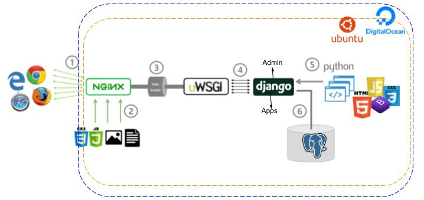

### YachayCode


YachaCode es una plataforma de gestión de contenido(CMS) minimal. Construido utilizando el marco Django, YachaCode proporciona una arquitectura potente para generar contenido de blog totalmente administrable y escalable.

### Requisitos:
- git
- pip3 
- virtualenv 
- python3.6.x 
- postgresql-9.5
- django2.2

### Requisitos S.O:
- Ubuntu server 18.04, 512MG a 1GB de ram, 1CPU y 8GB SSD.

### Ejecución en modo desarrollo:

Crear un entorno virtual(opcional)
```
virtualenv -p python3 env_yachaycode && source env_yachaycode/bin/activate
```
Clonar el proyecto:
```
git clone git@gitlab.com:iisotec/yachaycode.git
```
generando archivo de configuración, aquí cambiar sus configuraciones a base datos, etc
```
cp yachaycode/yachaycode/settings/config_example.json yachaycode/yachaycode/settings/config.json && cd yachaycode
```
Instalación de dependencias
```
pip install -r install requeriments.txt
```
Confgurar su DB, antes de ejecutar las migraciones.. 

```
./manage.py makemigrations  && ./manage.py migrate
```
Generación de super usuario
```
./manage.py createsuperuser
```
ejecutar en en modo desarrollo
```
 ./manage.py runserver
```
